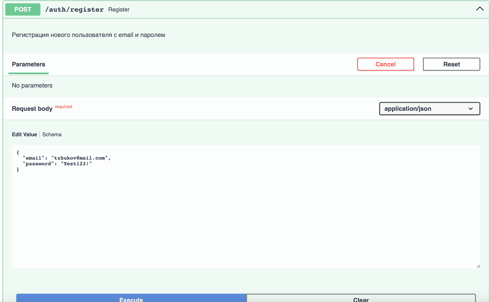
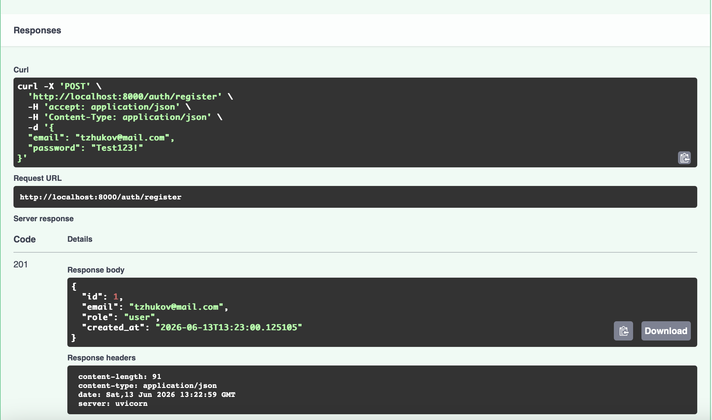
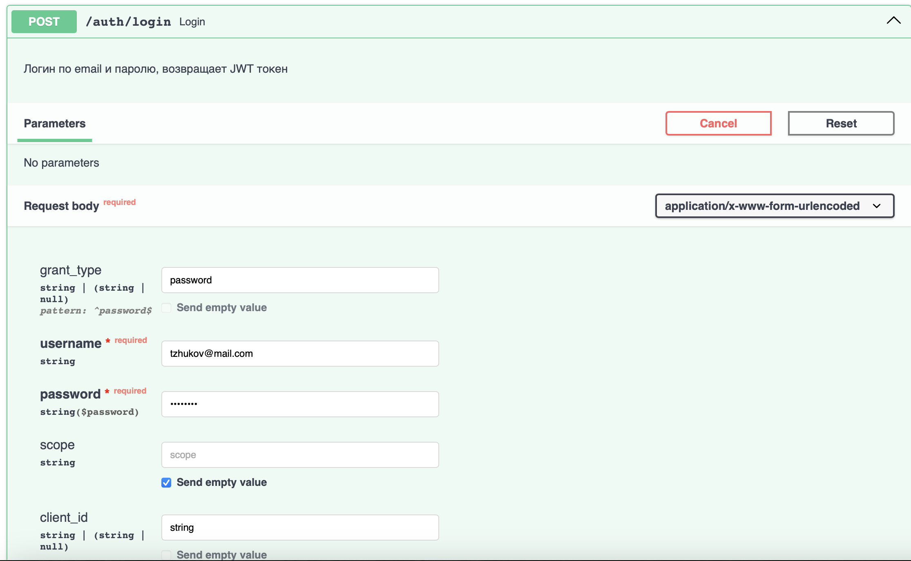
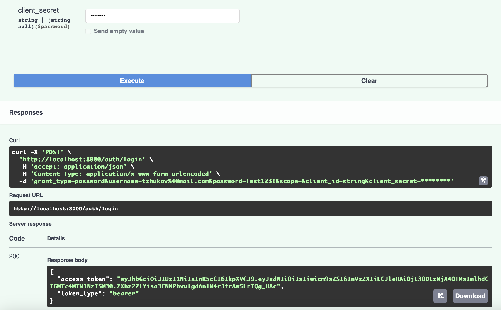
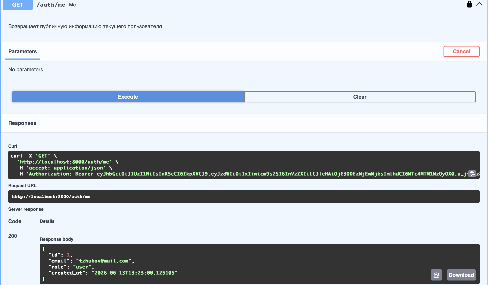
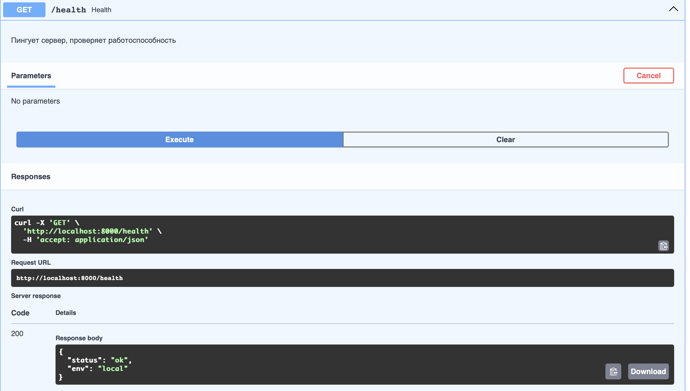
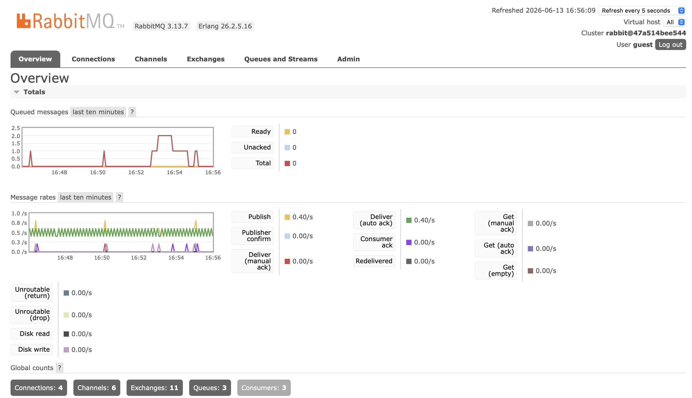
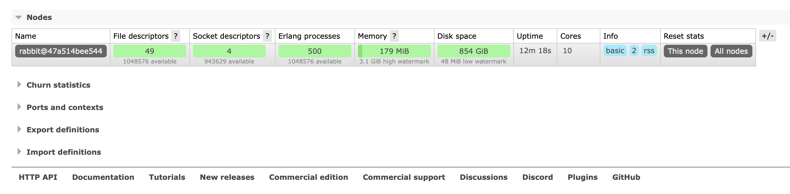
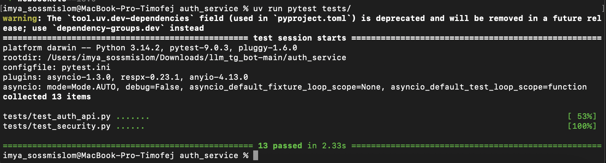
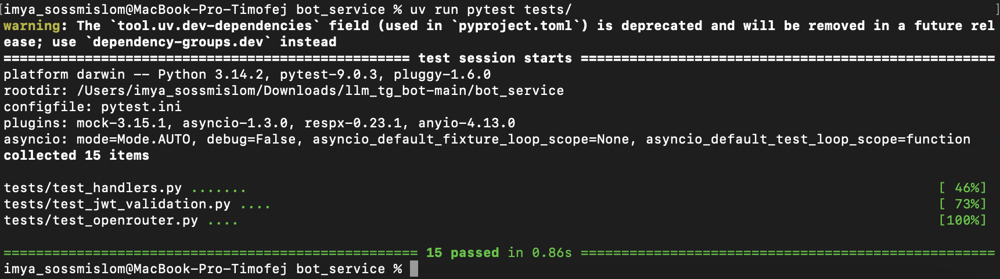

**Auth Service**

Auth Service предоставляет веб-API и Swagger по адресу http://0.0.0.0:8000/docs#/. В этом сервисе реализуются регистрация пользователя, вход (логин) и выдача JWT. Сервис хранит пользователей в базе (например SQLite или Postgres), хранит пароль только в виде хеша и формирует JWT с полями sub (id пользователя), role и временем жизни. Этот сервис является единственным местом, где выполняется “выпуск” токенов и управление пользователями.


**Bot Service**

Bot Service содержит Telegram-бота на aiogram. Основная логика: бот принимает сообщения пользователя, проверяет наличие JWT и валидирует его. Если токен валиден, бот отправляет запрос к LLM и возвращает ответ. Если токен отсутствует или неверный, бот отказывает в доступе и просит пользователя авторизоваться через Auth Service.

**Структура проекта**
```
llm_tg_bot/
├── auth_service/
│   ├── app/
│   │   ├── __init__.py
│   │   ├── main.py
│   │   ├── api/
│   │   │   ├── __init__.py
│   │   │   ├── deps.py
│   │   │   ├── routes_auth.py
│   │   │   └── router.py
│   │   ├── core/
│   │   │   ├── __init__.py
│   │   │   ├── config.py
│   │   │   ├── exceptions.py
│   │   │   └── security.py
│   │   ├── db/
│   │   │   ├── __init__.py
│   │   │   ├── base.py
│   │   │   ├── models.py
│   │   │   └── session.py
│   │   ├── repositories/
│   │   │   ├── __init__.py
│   │   │   └── users.py
│   │   ├── schemas/
│   │   │   ├── __init__.py
│   │   │   ├── auth.py
│   │   │   └── user.py
│   │   └── usecases/
│   │       ├── __init__.py
│   │       └── auth.py
│   ├── tests/
│   │   ├── __init__.py
│   │   ├── conftest.py
│   │   ├── test_auth_api.py
│   │   └── test_security.py
│   ├── .env
│   ├── Dockerfile
│   ├── pyproject.toml
│   ├── pytest.ini
│   └── uv.lock
│
├── bot_service/
│   ├── app/
│   │   ├── __init__.py
│   │   ├── main.py
│   │   ├── bot/
│   │   │   ├── __init__.py
│   │   │   ├── dispatcher.py
│   │   │   └── handlers.py
│   │   ├── core/
│   │   │   ├── __init__.py
│   │   │   ├── config.py
│   │   │   └── jwt.py
│   │   ├── infra/
│   │   │   ├── __init__.py
│   │   │   ├── celery_app.py
│   │   │   └── redis.py
│   │   ├── services/
│   │   │   ├── __init__.py
│   │   │   └── openrouter_client.py
│   │   └── tasks/
│   │       ├── __init__.py
│   │       └── llm_tasks.py
│   ├── tests/
│   │  ├── __init__.py
│   │  ├── conftest.py
│   │  ├── test_handlers.py
│   │  ├── test_jwt_validation.py
│   │  └── test_openrouter.py
│   ├── __init__.py
│   ├── Dockerfile
│   ├── .env
│   ├── pyproject.toml
│   ├── pytest.ini
│   └── uv.lock
├── screenshots
├── .gitignore
├── docker-compose.yml
├── main.py
└── README.md
```

**Сценарий работы**

1) Запустить приложение командой: ```bash docker-compose up -d```
2) Перейти по ссылке: http://localhost:8000/docs и зарегистрировать пользователя
3) Авторизоваться и получить токен
4) Передать токен в ТГ бота @my_llm_session_bot командой /token 
5) Выполненить запрос к модели
6) Остановить приложение командой: ```sudo docker-compose down```

**Сценарий тестирования**
1) Перейти в папку командой cd ```llm_tg_bot-main/<Папка сервиса>``
2) Синхронизировать виртуальное окружение uv: ```uv sync``` 
3) Провести тестирование ```uv run pytest tests/```


**Работа эндпоинтов в Swagger**

1) POST /auth/register 



2) POST /auth/login



3) GET /auth/me


4) GET /health 


**Telegram**


**Rabbit**

Демонстрация накопления сообщений



**Тесты**

1) auth_service


2) bot_service 

